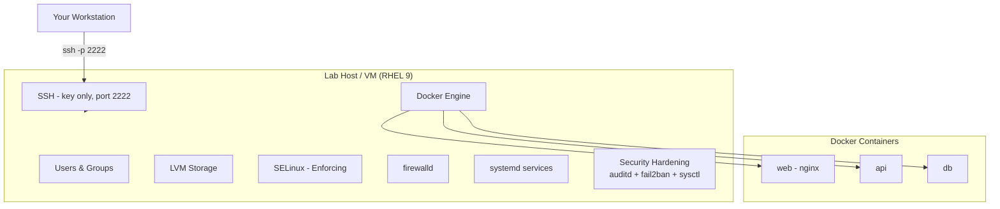

# Lab Architecture

This renders natively on GitHub (Mermaid support built into markdown preview).

## Network layout

| Host | Role | IP | SSH Port |
|---|---|---|---|
| rhcsa-lab | Single lab VM | 192.168.56.11 | 2222 (hardened) |

Built and tested in VirtualBox/KVM using a host-only or NAT network. This is a single-node lab by design — the focus is depth per topic (RHCSA/Linux+/Security+/Docker), not multi-node orchestration.
